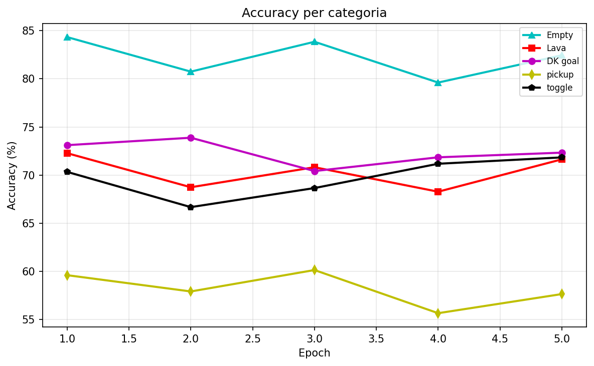

# LearningGrid

LearningGrid is a research-oriented framework built to study collaborative intelligence in [MiniGrid](https://minigrid.farama.org/) environments. Instead of using a single policy for every decision, the project combines multiple components with different roles: a reinforcement learning controller for reactive behavior, a planning helper for guidance, and a reviewer for sequence-level correction.

The central idea is to evaluate when collaboration is better than pure end-to-end control. In simple maps, the base policy can often act alone; in harder maps (lava constraints, key-door dependencies, sparse rewards), specialized support modules can improve robustness, sample efficiency, and trajectory quality. This makes LearningGrid both an experimental benchmark and a practical architecture for testing hybrid decision pipelines under controlled conditions.

From a methodological perspective, LearningGrid is organized as a progressive difficulty setup: Empty maps for motion stability, Lava maps for safe navigation under penalties, and DoorKey maps for long-horizon interaction planning. This progression is used to analyze transfer effects, failure modes, and the contribution of each module across increasing task complexity.

Within this architecture, [HeRoN](https://github.com/Seldre99/HeRoN/tree/main) is the integration mechanism that coordinates the three roles into a single decision pipeline. Rather than replacing the base RL policy, HeRoN orchestrates when assistance should be activated, how helper guidance is injected, and how reviewer feedback is used to refine action sequences. In LearningGrid, this provides a general framework to study hybrid control: autonomous behavior by default, targeted support when task structure or uncertainty makes collaboration advantageous.

## MiniGrid

MiniGrid is the core benchmark used in this project. It provides small grid-world tasks where an agent must reach a goal, avoid hazards, and solve interaction challenges.


In LearningGrid, MiniGrid is used across Empty, LavaCrossing, and DoorKey scenarios. This progression allows the project to move from basic navigation to obstacle avoidance and finally to multi-step interaction with objects such as keys and doors. The benchmark is useful because it keeps experiments controlled and reproducible while still offering different decision-making conditions.

## Environment Setup with requirements.txt

Before running the project modules, it is recommended to create an isolated Python environment and install dependencies from a `requirements.txt` file. This workflow works on Windows, macOS, and Linux, and can be used both with standard virtual environments and with Conda.

For a standard virtual environment (`venv`), create and activate the environment first, then install requirements.

Windows (PowerShell):

```powershell
python -m venv .venv
.\.venv\Scripts\Activate.ps1
pip install -r requirements.txt
```

macOS or Linux (bash/zsh):

```bash
python3 -m venv .venv
source .venv/bin/activate
pip install -r requirements.txt
```

If you prefer Anaconda/Miniconda, create a dedicated Conda environment and install the same requirements file.

Windows, macOS, and Linux (Conda):

```bash
conda create -n learninggrid python=3.10 -y
conda activate learninggrid
pip install -r requirements.txt
```

If you work in Visual Studio Code, open the project folder and select the interpreter of your active environment from the Command Palette using `Python: Select Interpreter`. After that, the integrated terminal will use the selected environment, and all project commands can be launched consistently from there.

This setup process is cross-platform: only the activation command changes between Windows and Unix-like systems, while dependency installation with `pip install -r requirements.txt` remains the same.

## DQN Agent

The DQN module is the main reinforcement learning baseline of the project. It trains a Deep Q-Network through a curriculum strategy: the agent starts from easier maps and then moves to harder environments.

### Strategy and Objective

The strategy follows progressive learning. In the first phase the agent learns stable movement in Empty maps, then it learns safe behavior in LavaCrossing maps, and finally it learns long-horizon interaction in DoorKey environments. The objective is to create a robust NPC policy that can generalize across tasks and serve as a reliable foundation for integrated systems such as HeRoN.

### How to Run from Command Line

```bash
python DQNAgent/train_all_maps.py
```

This command launches the full curriculum training pipeline.

## Helper

The Helper module supports the main agent by generating short action plans using an LLM. It is useful when the environment is more complex or when additional guidance is needed.

### What It Does and Objective

The Helper produces compact action sequences and can validate whether a plan is feasible before execution. The objective is to reduce inefficient exploration and improve action quality in difficult states.

### The Three Helper Strategies

The project includes three practical Helper strategies, each one designed for a different experimental goal and all available in the same entry point, `Helper/helper.py`. The first strategy is the threshold strategy, where helper intervention depends on a dynamic threshold and therefore becomes adaptive to episode evolution. This mode is useful when you want assistance that reacts to difficulty signals rather than being fixed in time.

The second strategy is the initial strategy. In this mode, the helper is active only in the first 15 moves of each episode, then control is left to the RL agent. This setup is useful when you want stronger guidance at the beginning of trajectories while preserving autonomous behavior in the rest of the episode.

The third strategy is the random strategy. In this configuration, helper calls are distributed with periodic/random logic over the episode schedule, which creates broader behavioral variation and helps test robustness under mixed support conditions.

### How to Run from Command Line

To run the final strategy (default):

```bash
python Helper/helper.py --strategy threshold --episodes 2650 --threshold 1.0 --decay 0.1 --render --verbose
```

To run the initial strategy (helper only in first moves):

```bash
python Helper/helper.py --strategy initial --initial-max-moves 15 --episodes 2650 --render --verbose
```

To run the random strategy:

```bash
python Helper/helper.py --strategy random --episodes 2650 --render --verbose
```

## Dataset

The Dataset module prepares the training data used by the Reviewer pipeline. It builds structured samples from MiniGrid trajectories and helper suggestions, so the reviewer can learn to correct action sequences rather than only single actions.

In practice, the generator creates an offline CSV with prompt, instructions, and response fields that are consumed by ReviewerPPO training scripts.

### How to Run from Command Line

Generate or refresh the reviewer dataset:

```bash
python Dataset/dataset_generator.py
```

Expected output artifact:

- `Dataset/reviewer_dataset_offline.csv`

This file is then used by supervised fine-tuning and PPO refinement scripts in ReviewerPPO.

## Reviewer

In this project, the Reviewer component is presented through ReviewerPPO, which is the sequence-level training pipeline used to improve reviewer behavior with fine-tuning and policy optimization. The goal is not only to classify single actions, but to produce more coherent action sequences when the Helper suggestion is partially incorrect or incomplete.


### Fine-tuning Result Visualization


The fine-tuning results show strong and well-balanced classification performance across all four main metrics. Accuracy reaches **89.7%**, while Precision, F1 Score, and Recall are even more tightly clustered — at **91.2%**, **91.1%**, and **91.0%** respectively. The near-perfect alignment between Precision and Recall is particularly significant: it indicates that the model is not biased toward either over-predicting or under-predicting corrections, achieving a healthy trade-off between false positives and false negatives. The low final evaluation loss (0.0506) confirms stable and consistent convergence during training.





ReviewerPPO is designed to strengthen correction quality in complex scenarios, especially where rare actions such as pickup and toggle are important. This is useful in DoorKey settings and in transitions where a naive model tends to overuse frequent actions. By combining supervised fine-tuning and PPO refinement, the reviewer becomes more robust and better aligned with the expected action trajectory.


### How to Run from Command Line

To run the base supervised fine-tuning workflow:

```bash
python ReviewerPPO/fine_tuning.py
```

To run PPO refinement on the unified weighted dataset:

```bash
python ReviewerPPO/ppo_training.py --model ReviewerPPO/Model/your_checkpoint --epochs 10
```

## HeRoN

HeRoN is implemented in the training script [HeRoN/heron.py](HeRoN/heron.py), where the DQN NPC, the Helper, and the Reviewer are coordinated in a single training pipeline. In this version, HeRoN manages curriculum and mixed phases, controls when Helper support is requested, and applies reviewer guidance to improve action quality over time.

### How HeRoN Works

The logic in [HeRoN/heron.py](HeRoN/heron.py) starts from the DQN policy as the default controller and introduces support adaptively, according to a chosen helper-call strategy. During training, the system monitors performance and activates guidance when useful, while still preserving reinforcement learning stability. The same script can optionally train or reuse a reviewer model, so experiments can be executed from a single entry point.

### How to Run from Command Line

```bash
python HeRoN/heron.py --strategy final --episodes 450
```

Example on a single environment with rendering:

```bash
python HeRoN/heron.py --env MiniGrid-Empty-8x8-v0 --episodes 100 --strategy final --render --verbose
```

Example with explicit pretrained models:

```bash
python HeRoN/heron.py --dqnagent DQNAgent/Model/CurriculumAgent/master_model_universal.pth --reviewer ReviewerPPO/Model/your_checkpoint --strategy final --episodes 450
```

Example with reviewer training before RL training:

```bash
python HeRoN/heron.py --train-reviewer --strategy final --episodes 450
```

### Results

The evaluation should be reported by strategy, because both Helper and HeRoN are tested with three strategy modes: final, initial, and random. For this reason, results are organized in separate tables instead of a single aggregated table.

#### Helper Strategy Results

| Strategy | Episodes | Success Rate (%) | Avg Steps | Avg Reward |
|---|---:|---:|---:|---:|
| Final | 2650 | 84.4 | 56.6 | 116.5 |
| Initial | 2650 | 79.0 | 85.2 | 102.1 |
| Random | 2650 | 77.1 | 60.9 | 99.2 |

#### HeRoN Strategy Results

| Strategy | Episodes | Success Rate (%) | Avg Steps | Avg Reward |
|---|---:|---:|---:|---:|
| Final | 2650 | 85.4 | 46.4 | 106.7 |
| Initial | 2650 | 75.6 | 84.7 | 87.2 |
| Random | 2650 | 70.7 | 56.7 | 78.2 | 

#### DQN Results


| Configuration | Episodes | Success Rate (%) | Avg Steps | Avg Reward |
|---|---:|---:|---:|---:|
| NPC only (DQN) | 2650 | 55.0 | 193.3 | 15.5 |

## Contributions

This project was developed by 
- Luca Giuliano, Master's student in Data Science and Machine Learning,
- Luigi Giachetti, Master's student in Data Science and Machine Learning.

## Citations

If you use this project, please cite and acknowledge the original MiniGrid benchmark and the HeRoN source:

1. MiniGrid (official environments page, Farama Foundation):
	https://minigrid.farama.org/environments/minigrid/

2. MiniGrid benchmark paper (NeurIPS Datasets and Benchmarks, 2023):
	https://proceedings.neurips.cc/paper_files/paper/2023/file/e8916198466e8ef218a2185a491b49fa-Paper-Datasets_and_Benchmarks.pdf

3. HeRoN implementation (official GitHub repository):
	https://github.com/Seldre99/HeRoN/tree/main

4. MiniGrid source repository (Farama Foundation, pinned commit):
	https://github.com/Farama-Foundation/Minigrid/tree/5462813b9016d6b81b53ba200000f8aa12ba3ba6
